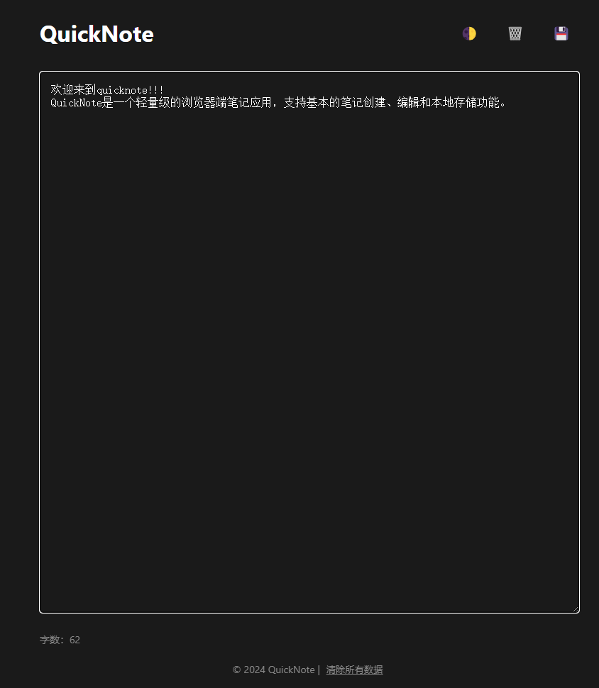

# QuickNote

一个简单但功能强大的浏览器端笔记应用。

## 特性

- 🚀 轻量级，无需安装
- 💾 自动保存
- 🌓 深色模式支持
- 📊 字数统计
- 💻 响应式设计
- 📥 笔记导出功能
- 🔄 本地存储

## 技术栈

- HTML5
- CSS3
- JavaScript (原生)
- Python (用于开发服务器)
### 项目截图

## 快速开始

1. 克隆仓库
bash
git clone https://github.com/ai-dengwsh/quicknote.git
或
git clone https://gitee.com/Wenshandeng/quicknote.git
bash

2. 启动服务器
bash
python server.py

3. 访问应用
打开浏览器访问 `http://localhost:8000`

## 贡献

欢迎提交 Issues 和 Pull Requests！

## 许可证

本项目采用 MIT 许可证 - 查看 [LICENSE](LICENSE) 文件了解详情

## 作者

- GitHub: [@ai-dengwsh](https://github.com/ai-dengwsh)
- Gitee: [@Wenshandeng](https://gitee.com/Wenshandeng)